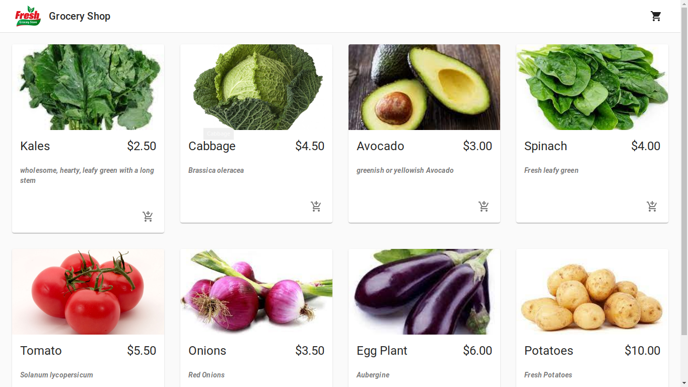
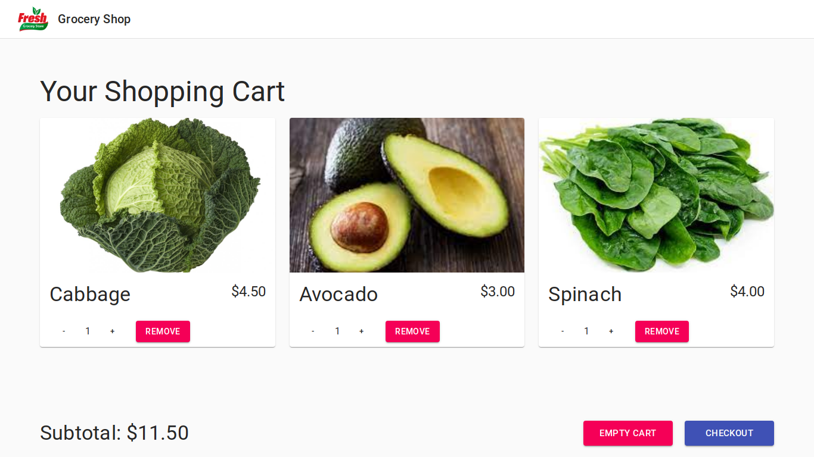
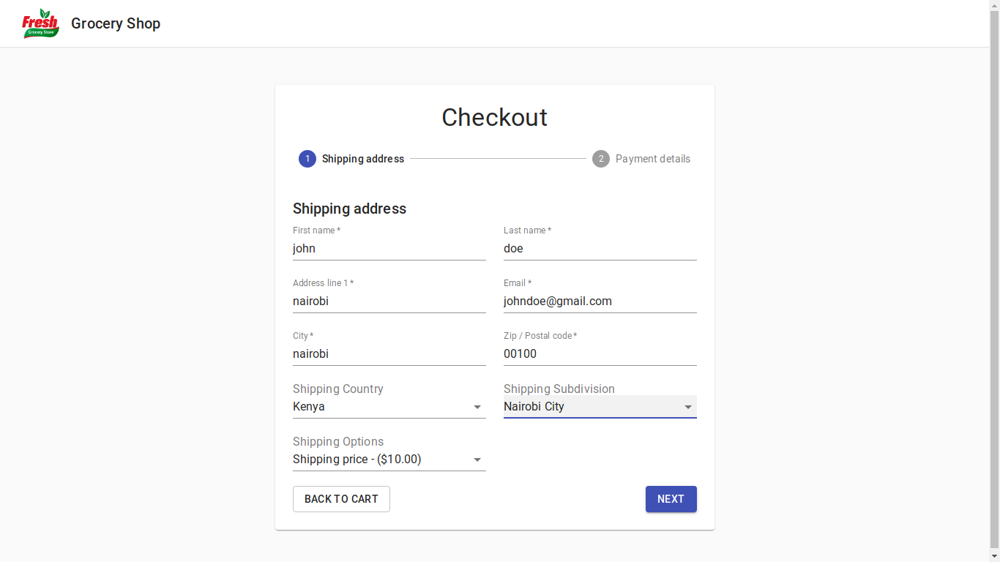
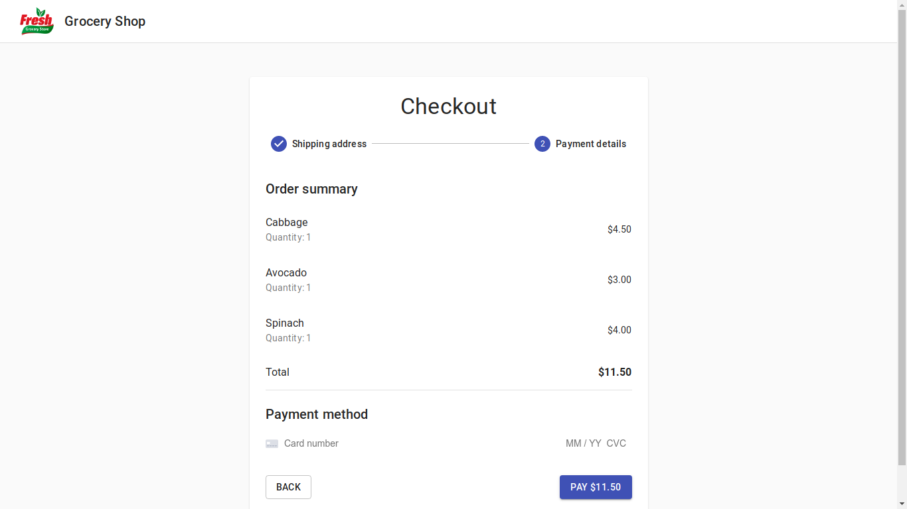

# GroceryStore

- [GroceryStore](https://ecstatic-mclean-878aa2.netlify.app) - Grocery Store Website (Demo)

# GroceryStore

Grocery App, is online shopping cart, geniune web application to which you can rely on. It guides you to formulate incredible mobile application. It comprise of 5+ screens with different features to navigate screens easily.
Various different screens are assembled to  construct systematic structure.
Code used, as well as layers are well organized and are named precisely for the user to interpret properly. Code which is being used to model the application is composed of today's  trend.  Changing text, colours and graphics or placing photos will never be a big issue. You can do it with ease. Pixel perfect resolution gives perfect design, while customised elements assist in easy editing.
Grocery store template is created as a wonderful solution for any agricultural or organic food shop . It is a template for an Android developer that want to create grocery application with a clean design. The template is only lay outing without data flow and communication with the backend system. This UI Template can reduce your development time and will loved by developer that hate lay outing design!  You can use this app as one big super market app to sale product of your store. This app make easy for user to buy the product from store with easy steps and store can get easy order.
Open source Grocery list app. This Grocery list will make it easier for you to make a shopping list at any time and anywhere. You will be able to add and remove items from the list. After adding everything, simply tap the shopping cart to get your total bill. It is one of the best free grocery list app on Android market.
This is an open source grocery application that can be used by anyone at zero cost. good for both grocery and departmenta stores. This App is designed to make grocery shopping easy and fun. It also works on smartphone with low-memory capacity and on tablets with large display. user can show large quantity of products and details information on product page: 
App:  [https://ecstatic-mclean-878aa2.netlify.app/](https://ecstatic-mclean-878aa2.netlify.app/)

## Screen (Content)

```
Everything was made with a detail oriented style and followed by today's web trends. Clean coded & Layers are well-organized, carefully named, and grouped. The website and websites look amazing and it's already a great place to start. 

One of the best things about this website is that it is focused on nurturing the skills of individuals interested in fashion design. No matter if you're a novice or an experienced designer, you will find dressing for your body type useful. It's also great for learning new fashion trends and how to dress tastefully in different colors without appearing tacky or cheap looking.

```

**Description**

- Grocery App Template
- Grocery App UI is supported in all Devices.
- Customise elements (easy to edit)
- 100% free fonts
- Perfect pixel (high quality design)
- Very clean and cool UI
- Free updates
- license
-Api Integration
-js with commerce.js
-Powerful Dashboard
-Add , Manage Category with [commerce.js](https://commercejs.com/)
-Add , Manage Items with [commerce.js](https://commercejs.com/)
-Update Price,
-View Orders (Confirmed, Preparing, On Way, Delivered)
-Manage Customers
-App Token Authentication

## Screen








